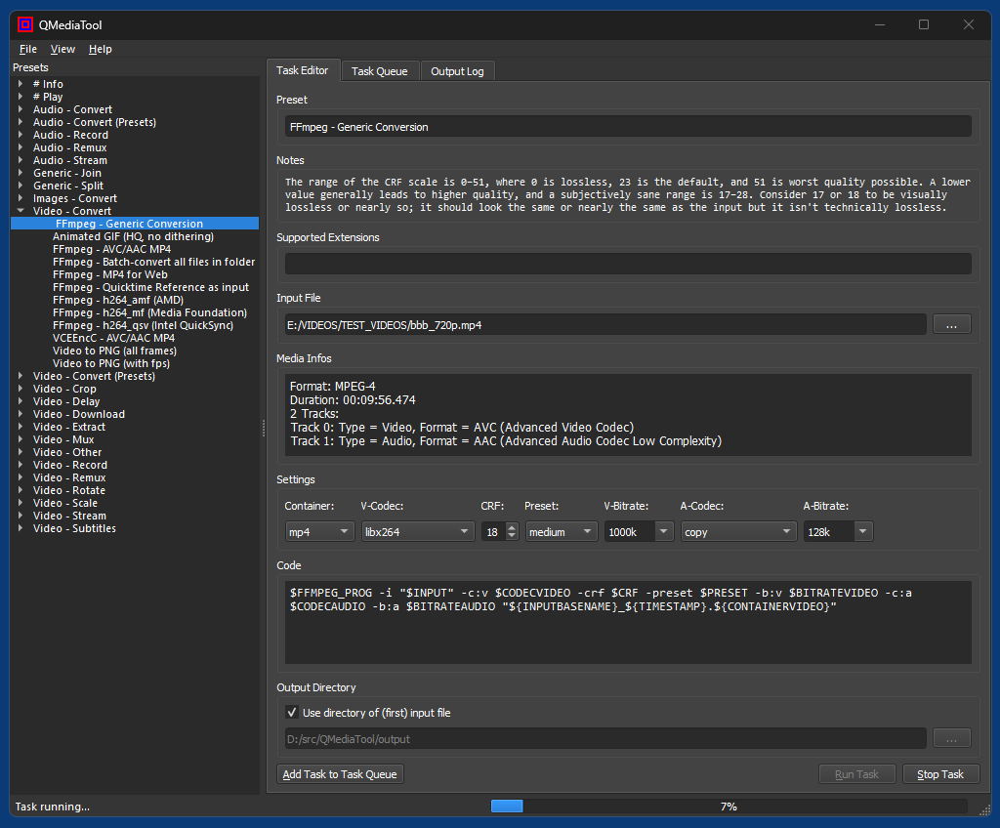
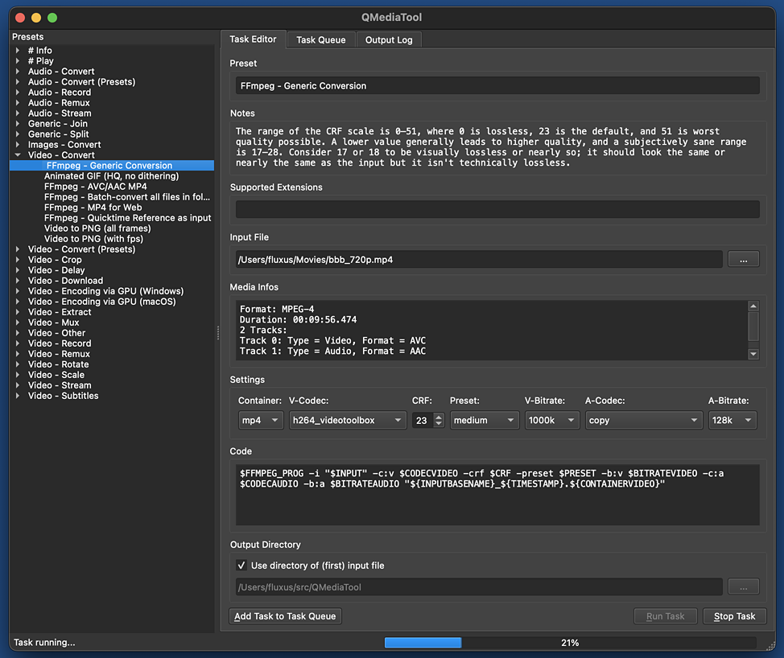
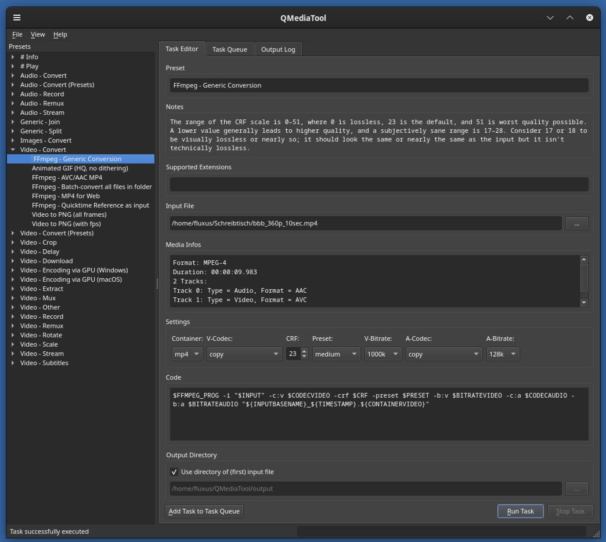

# QMediaTool
A general purpose media conversion tool based on Python 3, PyQt5, SQLite 3 and [FFmpeg](https://ffmpeg.org/).

# Setup

## Windows

I decided to remove all binaries from this repository, instead those now come from external platform-specific repositories.
```
https://github.com/59de44955ebd/QMediaTool.git
cd QMediaTool
git clone https://github.com/59de44955ebd/QMediaTool-bin-win.git resources/bin/win
```

## macOS
```
https://github.com/59de44955ebd/QMediaTool.git
cd QMediaTool
git clone https://github.com/59de44955ebd/QMediaTool-bin-macos.git resources/bin/macos
```

## Linux
```
https://github.com/59de44955ebd/QMediaTool.git
cd QMediaTool
git clone https://github.com/59de44955ebd/QMediaTool-bin-linux.git resources/bin/linux
```
In Linux no actual binaries are bundled with the application, "QMediaTool-bin-linux" only contains dummy shell scripts. You have to install the actual binaries yourself, e.g. in Debian/Ubuntu by running:
``` 
# note: gpac (MP4Box) is only available in Ubuntu, in Debian you have to compile it yourself
sudo apt install ffmpeg atomicparsley mediainfo vlc yt-dlp gpac
```

# Screenshots
*QMediaTool in Windows 11*  


*QMediaTool in macOS 13*  


*QMediaTool in Linux (Debian 12/Cinnamon)*  


# Usage #

## Presets and Tasks ##

QMediaTool is basically a database for your favorite ffmpeg command lines, which are called "presets" in the app. Presets can be organized under arbitrary categories, the predefined categories and presets are just an offer, and you might as well delete or rename them as desired and use your own ones.

You can add new presets and categories via app menu, existing presets and categories can be changed or deleted via context menu in the "Presets" pane.

Presets are templates for actual tasks, and a preset is loaded into the "Task Editor" by double-clicking its name in the "Presets" pane.

Presets/tasks can either have just a single or multiple lines of code. Task code is always executed with [Bash](https://www.gnu.org/software/bash/), both in macOS and Windows. The Bash shell for Windows is based on [MSYS](https://www.msys2.org/), in addition to the predefined Bash commands also the following commands can be used: basename, cat, cp, cygpath, dirname, env, find, grep, kill, ls, mkdir, mv, rm, rmdir, sleep, sort, tee.

You can edit a task's code (loaded from a preset) at runtime before executing it, and e.g. adjust/add/remove parameters etc. There are also GUI widgets for some basic FFmpeg parameters, so you can either use those to adjust values (which are then provided to the task as environment variables, see below) or by typing them into the code field.

Presets can have 0, 1 or multiple files or a URL as input, input files can be added by dropping them into the app window.

## Environment variables ##

When a selected preset is executed as task, in addition to the system's default variables the following environment variables are provided:

### General variables: ###

* _$TOOLNAME_             - for any provided tool (see below), so e.g. $FFMPEG for ffmpeg.
* $START                  - selected start time in seconds (float)
* $END                    - selected end time in seconds (float)
* $DURATION               - selected duration in seconds (float)
* $CONTAINER              - selected container (string)
* $CONTAINERVIDEO         - selected video container (string)
* $CONTAINERAUDIO         - selected audio container (string)
* $CONTAINERIMAGE         - selected image container (string)
* $CODECVIDEO             - selected video codec (string)
* $CODECAUDIO             - selected audio codec (string)
* $BITRATEAUDIO           - selected bitrate
* $PRESET                 - selected preset
* $FPS                    - selected fps (float)
* $CRF                    - selected crf (int)
* $DEVICEVIDEO            - selected video device (name in Windows, index in macOS)
* $DEVICEAUDIO            - selected audio device (name in Windows, index in macOS)
* $OUTPUTDIR              - selected output directory
* $TIMESTAMP              - current time in format "Ymd_HMS"
* $IS_WIN                 - true if current OS is Windows, otherwise false

### Single input file mode: ###

* $INPUT                  - input file as full path
* $INPUTDIR               - directory of input file
* $INPUTBASENAME          - filename of input file (with spaces replaced by underscore)
* $INPUTEXT               - file extension if input file
* $FORMAT0, $FORMAT1, ... - format of first, second, ... track
* $FPS0, $FPS1, ...       - frame rate of first, second, ... track
* $TRACK                  - number of selected track (starting at 0)
* $FORMAT                 - format of track selected by $TRACK

### Input url mode: ###

* $URL                    - URL entered into field "Input URL"

### Multiple input files mode: ###

* $CNT                    - the number of input files
* $INPUT0, $INPUT1, ...   - first, second, ... input file as full path
* $INPUTEXT               - extension of first input file
* $INPUTBASENAME          - filename of first input file (with spaces replaced by underscore)


## Provided/included binaries ##

In adition to ffmpeg, the following binaries are included both for macOS and Windows:

* atomicparsley           - command-line MP4/MOV parser
* ffmpeg_grid             - shell script that combines input videos to a single "grid" (or "mosaic") video (mainly provided for demonstration purposes)
* ffmpeg_prog             - single line shell script that replaces "ffmpeg" with "ffmpeg -hide_banner -progress tcp://localhost:9999". QMediaTool listens for progress messages from ffmpeg on port 9999 and displays a progress bar (as well as taskbar progress info in Windows) based on those messages. So you can use $FFMPEG_PROG instead of $FFMPEG for any ffmpeg task that allows to give proper progress feedback.
* ffplay                  - command-line media player based on ffmpeg code
* ffprobe                 - command-line tool to display media information, based on ffmpeg code
* mediainfo               - tool that displays technical information about media files
* mp4box                  - MP4 packaging command-line tool provided by the GPAC project
* vlc                     - shell script that calls and forwards arguments to VLC (which is expected at the default location)
* yt-dlp                  - command-line download manager for media files hosted on YouTube and many other video hosters

Those tools are just an offer, you might as well remove them and instead add others. To add a new tool - either a binary or a shell script - called _toolname_ (or _toolname.exe_), create a new folder called _toolname_ in resources\bin\win\ (Windows) or QMediaTool.app/Contents/Resources/bin/macos/ (macOS) and put it into this folder. After restarting QMediaTool, you can  reference it in presets/tasks using variable _$TOOLNAME_ (all upper case).

If you prefer to use your system's/a pre-installed version of ffmpeg instead of the provided binary, you can rename or delete the provided binary in resources\bin\win\ffmpeg\ (Windows) or QMediaTool.app/Contents/Resources/bin/macos/ffmpeg, and instead put a single line shell script called "ffmpeg" into this folder which might look like this:

`/usr/local/bin/ffmpeg "$@"`

Or, in Windows:

`D:/bin/ffmpeg.exe "$@"`

Or if ffmpeg can be found in the system path, just:

`ffmpeg "$@"`

Of course this approach also works for the other provided binaries.
